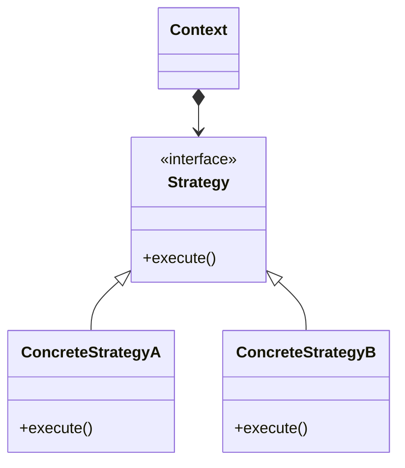
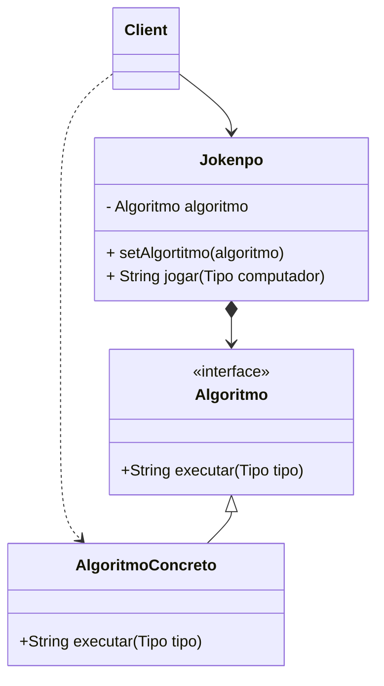

# Design Pattern Strategy

```mermaid
classDiagram
    
    Context *--> Strategy
    Strategy <|-- ConcreteStrategyA
    Strategy <|-- ConcreteStrategyB
    
    class Context{ }
    class Strategy {
        <<interface>>
        +execute()
    }
    class ConcreteStrategyA {
        +execute()
    }
    class ConcreteStrategyB {
        +execute()
    }
```

# Strategy aplicada ao JoKenPo

Implementação do algoritmo parcial com base no Padrão Strategy.

```mermaid
classDiagram

    Client --> Jokenpo
    Client ..> AlgoritmoConcreto
    Jokenpo *--> Algoritmo
    Algoritmo <|-- AlgoritmoConcreto


    class Client { }

    class Jokenpo {
        - Algoritmo algoritmo
        + setAlgortitmo(algoritmo)
        + String jogar(Tipo computador)
    }

    class Algoritmo {
        <<interface>>
        +String executar(Tipo tipo)
    }

    class AlgoritmoConcreto {
        +String executar(Tipo tipo)
    }

```